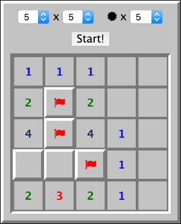

# minesweeper-reactjs



This app is a minesweeper clone implemented with React.js.

## Requirements
* node(`v4.0.0` or later)
* npm

## How to play
### Online
Let's access [GitHub Pages](http://yasaichi.github.io/minesweeper-reactjs)!

### Offline
```sh
git clone git@github.com:yasaichi/minesweeper-reactjs.git
cd minesweeper-reactjs
npm install
npm run boot
```

Then, open the following URL in your browser:

```
http://localhost:8080
```
